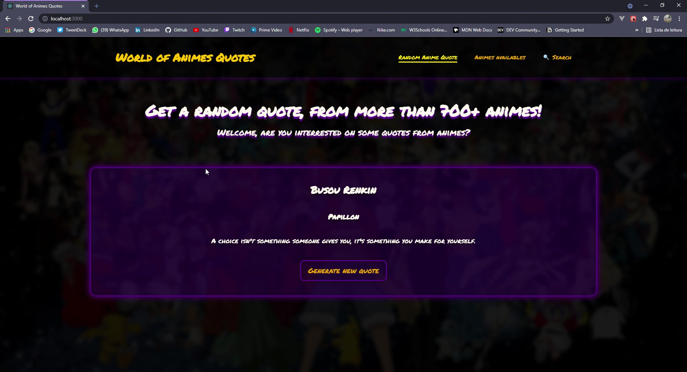
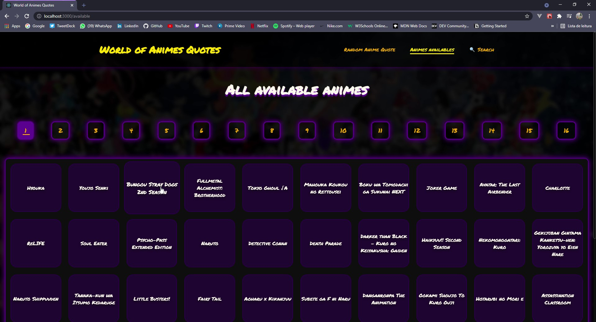
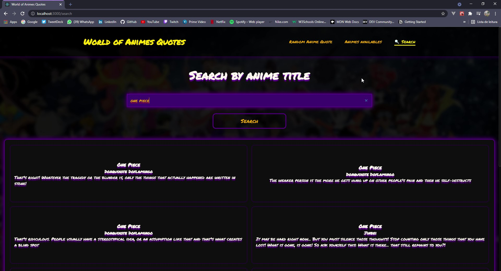

# 🗻 AnimeQuotes
**Uma aplicação para gerar citações do mundo dos animes.**

## 📝 Sobre
Uma aplicação utilizando uma API de citações de animes, onde podemos gerar uma citação randômica, verificar quais animes estão disponíveis e também podem pesquisar por algum título especifico e verificar algumas citações de tal anime.

## 📸 Imagens

  
  
  

## 🧰 Tecnologias
  - React.js
  - Typescript
  - styled-components
  - axios
  - react-router

## 👨🏽‍🚀 Autor
#### Feito com 🤎 por *[Gabriel Bittencourt Penteado](https://www.linkedin.com/in/gabriel-bittencourt-penteado/)*. Entre em contato! 👋🏽